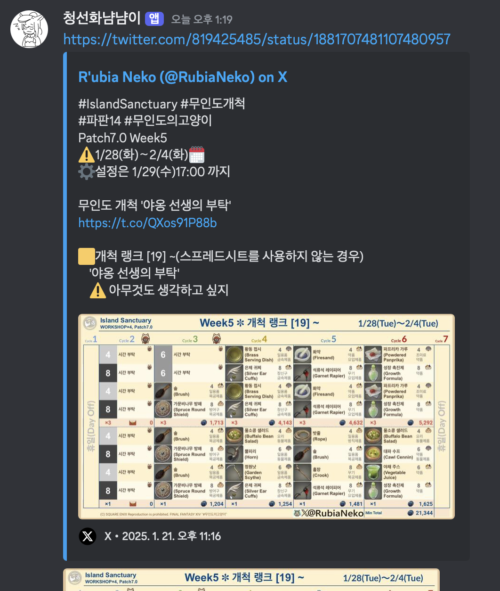
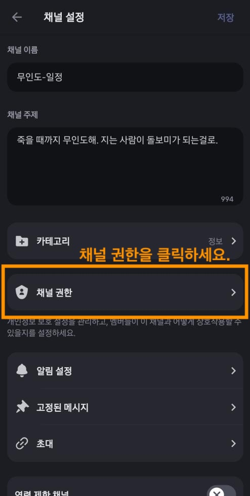
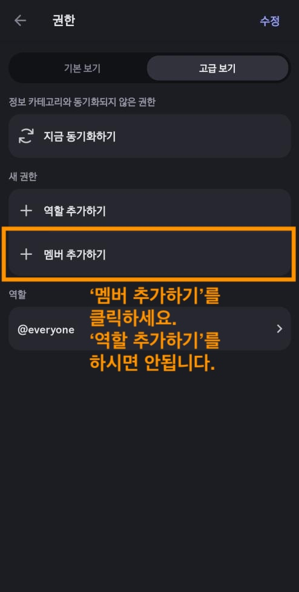
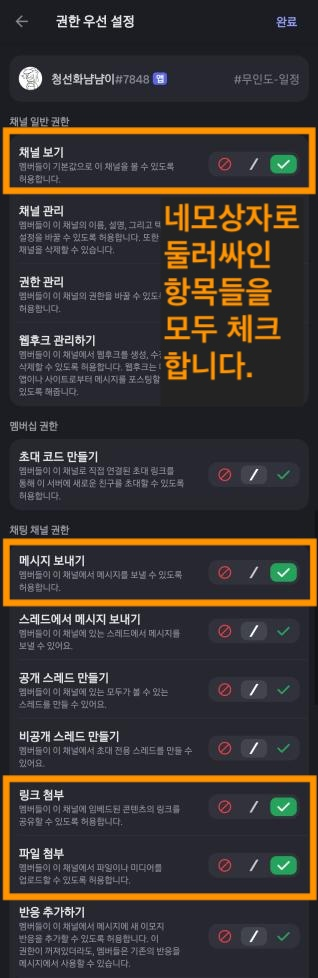
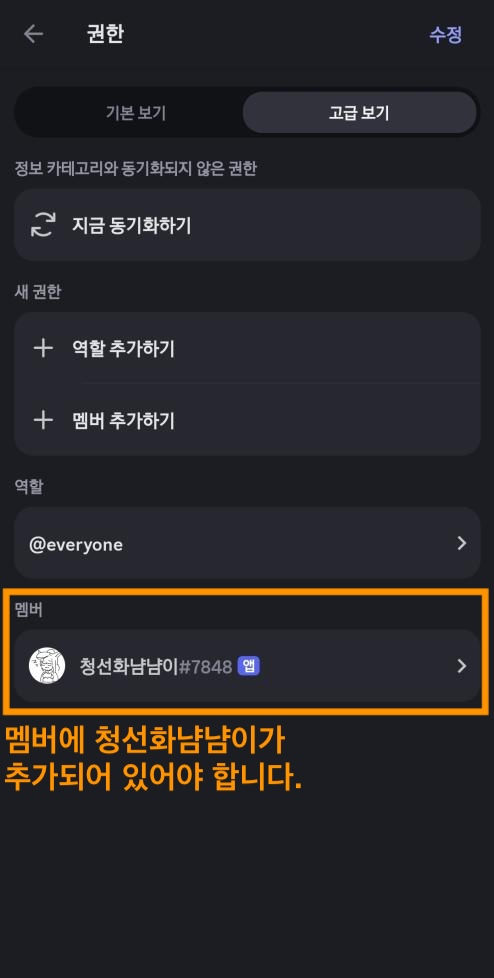

# SeafarersCowrieeater

청선화 냠냠이

[@RubiaNeko](https://x.com/rubianeko)님께서 서울특별시 기준 매주 화요일마다 올려주시는 '한국서버 다음주 무인도 일정 트윗'을 원하는 디스코드 텍스트 채널에 자동으로 전송해주는 디스코드
앱입니다.

서울특별시 기준 수요일 자정에 메시지를 전송합니다.

## 봇 추가방법

[서버에 봇을 초대하는 주소](https://discord.com/oauth2/authorize?client_id=1327908331741909147&permissions=52224&integration_type=0&scope=bot)

위 주소를 클릭하여 원하는 서버에 봇을 추가합니다.

## 받을 텍스트 채널을 설정하는 법

1. 원하는 텍스트 채널을 우클릭하여 채널 설정으로 들어갑니다.
2. 채널 설정에서 채널 권한을 클릭합니다.
3. 채널 권한에서 멤버 추가하기를 클릭합니다.
4. 청선화냠냠이를 추가하고 다음 권한을 부여합니다.
    - 채널 보기
    - 메시지 보내기
    - 링크 첨부
    - 파일 첨부

### 스크린샷으로 따라가기

1. 원하는 텍스트 채널을 우클릭하여 채널 설정으로 들어갑니다.
2. 채널 설정에서 채널 권한을 클릭합니다.

3. 채널 권한에서 멤버 추가하기를 클릭합니다.

4. 청선화냠냠이를 추가하고 다음 권한을 부여합니다.

5. 모두 마쳤을 때 아래와 같이 보이면 완료입니다.

---

감사합니다.

