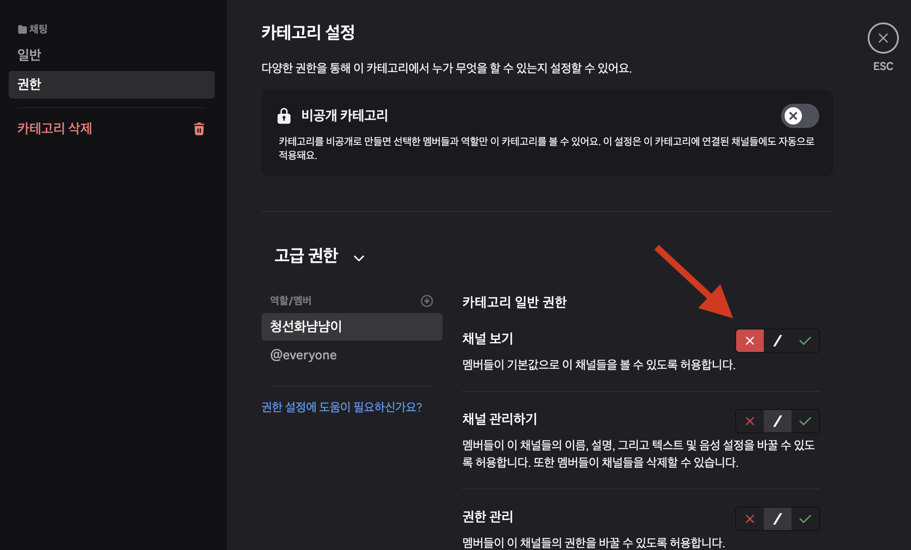
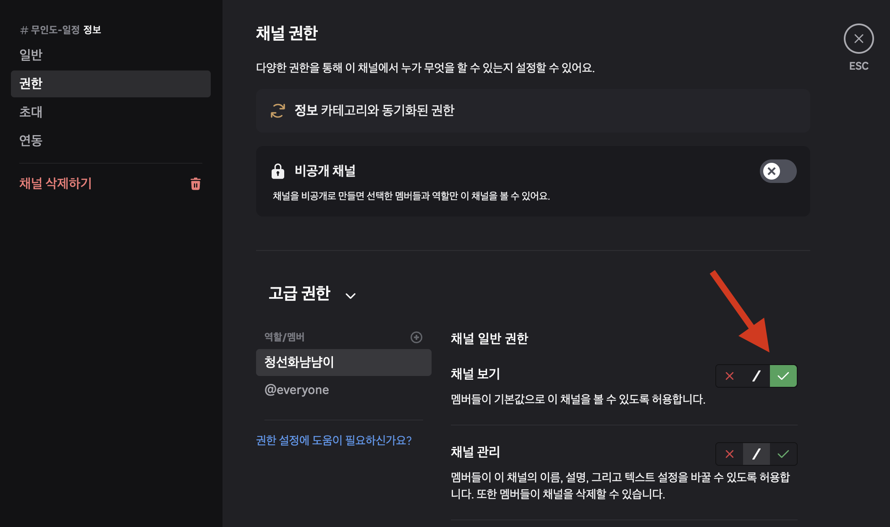

### 업데이트

2025-02-14 봇 공개

2025-07-31 원본 트윗의 내용 변경을 따라 트윗 서치 키워드를 'Week'에서 '주간'으로 갱신

# SeafarersCowrieeater

**청선화 냠냠이**

[@RubiaNeko](https://x.com/rubianeko)님께서 매주 올려주시는 '한국서버의 이번주 개척 공방 무인도 산품 무역 – 주간 스케줄 트윗'을 원하는 디스코드 텍스트 채널에 전송해주는 디스코드
앱입니다.

## 사용방법

1. [서버에 봇을 초대하는 주소](https://discord.com/oauth2/authorize?client_id=1327908331741909147&permissions=52224&integration_type=0&scope=bot)를 클릭하여 원하는 서버에 봇을 추가합니다.
2. (중요)청선화 냠냠이가 메세지를 올리길 원하는 텍스트 채널에서만 해당 채널을 볼 수 있도록 권한 수정을 해주세요.

### 권한 수정 예시

청선화 냠냠이가 메세지를 올리지 않았으면 하는 채널 혹은 카테고리

청선화 냠냠이가 메세지를 올리길 원하는 채널 혹은 카테고리

## 주의사항

1. 권한 수정을 하지 않을 경우, **_모든_** 텍스트 채널에 청선화 냠냠이가 범람합니다!

---

감사합니다~

